# Transit Accessibility and Deprivation: Exploring Spatiotemporal Heterogeneity and Association

Author: Zihao Zhou

Date: Ongoing

**Note: the content presented here are preliminary and are subject to change. This text is a shortened version of the actual research paper.**

## Abstract
Following the "transport's economization", public transportation was rapidly constructed and reconstructed to (at least aimed to) simultaneously achieve economic, social, and environmental goals. However, even with a massive volume of literature around accessibility, the actual relationship between public transport accessibility and socioeconomic status has hitherto received scant attention from scholars. This study thus addresses this gap using a GIS-based quantitative approach. Transit accessibility with varied characterization approaches (including gravity method, cumulative opportunities method and spatial separation method) was calculated from various sources (including transit network, timetable road network, POIs and other socioeconomic data), using ArcGIS network analyst. In the analysis stage, this project first explored the spatial heterogeneity of urban deprivation and public transport accessibility using methods such as Global Moran's I, Getis-Ord Gi*, and Anselin Local Moran's I. Spatial patterns and autocorrelation is identified. Then, this study carried out a correlational analysis to explore the spatiotemporal relationship between deprivation and accessibility. Lastly, the factors which contribute to this relationship were briefly discussed.

## Methodology
### Conceptual Framework
The transportation network data will be first pre-processed, followed by construction of a multilayered network dataset, combing a range of different modes including buses routes, underground and overground railway lines, light rail lines, and walking. After establishing the network dataset, an origin-destination (O-D) cost matrix will be produced.
After producing the O-D cost matrix, this study will calcu- late the spatial integral public transit accessibility with both the spatial separation and gravity method.

The data analysis of this study includes (1) spatial analysis of the heterogeneity and autocorrelation of urban depri- vation and transit accessibility (2) correlational analyses to evaluate the correlation between urban deprivation and transit accessibility.

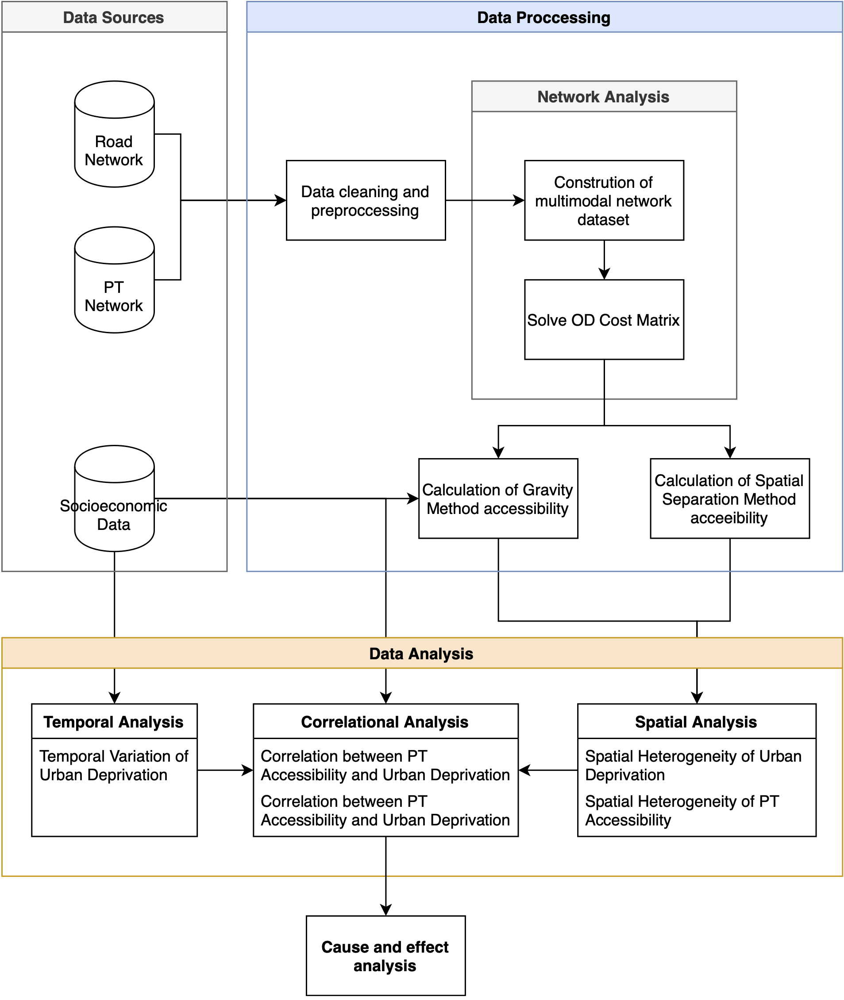
*Figure 2.1: Conceptual Framework*

### Data Sources
#### Transportation Network Data

1. Road network in polyline vector format from Open Street map (OSM)
2. Public Transit (PT) network and timetables in GTFS format from Traveline

#### Socioeconomic Data

1. Deprivation measure from UK Ministry of Housing, Communities and Local Gov.
2. Commuting flows OD data from the census bureau

    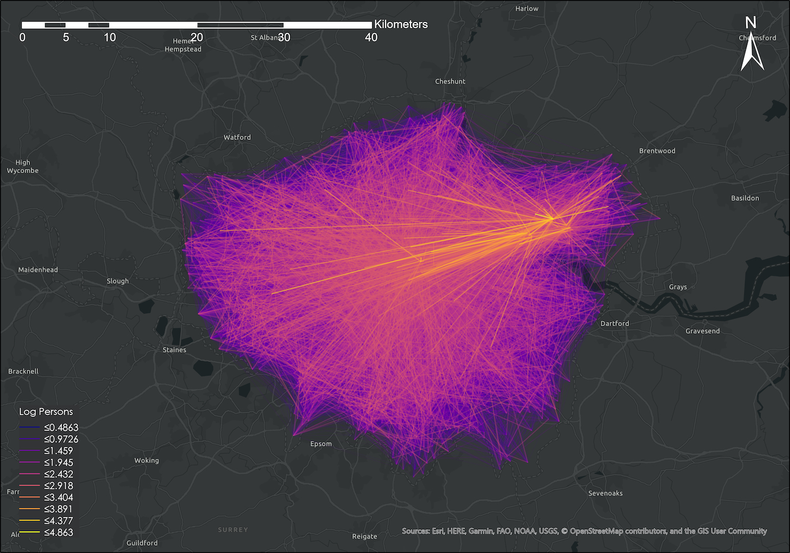
    *Figure 2.4: Commuting flows OD data*

### Analysis of Spatial Heterogenity
Global spatial autocorrelation will be accessed using the Global Moran's I and the Getic-Ord General G statistic. Local spatial autocorrelation will be assessed using An-selin Local Moran’s I and Getis-Ord Gi\* statistic.

#### Global spatial autocorrelation analysis

Firstly, the precense of global spatial autocorrelation will be detercted using the Global Moran’s I statistic. The Global Moran’s I Statistic is defined as:

$$ I=\left(n\sum_{i=1}^{n}\sum_{j=1}^{n}{w_{i,j}\left(d\right)z_iz_j}\right)\left(\sum_{i=1}^{n}z_i^2\sum_{i=1}^{n}\sum_{j=1}^{n}w_{i,j}\left(d\right)\right)^{-1} $$

Where n is the total number of spatial units, wi,j(d) is the spatial weight between i and j, defined by a spatial weight matrix, a symmetric Boolean matrix. zi is the devi- ation of the attribute value of a feature i from the global mean of that attribute.

If the z-score is positive, then a positive spatial autocor- relation is foundm, and vice versa.

If a statistically significant global spatial autocorrelation is found, the Getis-Ord General G statistic can then be used to evaluate the characteristic of the autocorrelation, identifying whether it is the low or high values.
Getis-Ord General G statistic is defined as:

$$ G=\left(\sum_{i=1}^{n}\sum_{j=1}^{n}\left(w_{i,j}\left(d\right)x_ix_j\right)\right)\left(\sum_{i=1}^{n}\sum_{j=1}^{n}{x_ix_j}\right)^{-1} $$

Where xi is the attribute value of a feature i.

#### Local spatial autocorrelation analysis
The Local Moran’s I statistic, which was decomposed from the Global Moran’s I statistic to the local level by Luc Anselin, can be used to identify hotspots and spatial outliers. The I statistic is defined as:

$$ I_i=\frac{x_i-\bar{x}}{S_i^2}\sum_{j=1,\ j\neq i}^{n}{w_{i,j}\left(d\right)\left(x_j-\bar{x}\right)} $$

Where Si2 is the sample variance.

Here, a positive I indicates that the is part of a cluster, while negative I indicates that it is part of a outlier.
The Getis-Ord Gi* statistic, which is also called Getis-Ord local G statistic, is defined as:

$$ G_i^\ast=\left(\sum_{j=1}^{n}{w_{i,j}\left(d\right)x_j}-\bar{x}\sum_{j=1}^{n}{w_{i,j}\left(d\right)}\right)\left(S\sqrt{\left(n\sum_{j=1}^{n}{w_{i,j}^2\left(d\right)}-\left(\sum_{j=1}^{n}{w_{i,j}\left(d\right)}\right)^2\right){(n-1)}^{-1}}\right)^{-1} $$

The larger the positive G, the more intense the hotspot (high values are more clustered). If G is negative, then the smaller the score, the more intense the coldspot.

### Characterizing Deprivation
This study will measure depriva- tion using the English Indices of Deprivation (IoD), a set of indices developed by the UK Ministry of Housing, Communities and Local Government.

The IoD includes not only economic deprivation, but includes a variety of different categories of deprivation (See Figure 2.6).

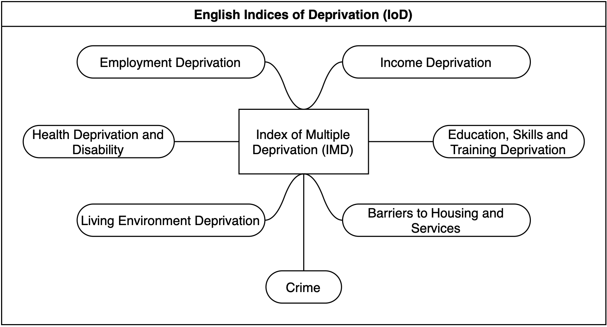
*Figure 2.6: Categories of deprivation used in IoD*

### Characterizing Accessibility
This study thus uses a multi-model approach for measuring accessibility - calculates both spatial separation and gravity-based accessibility.

#### Spatial separation method
The spatial separational accessibility for each Lower Super Output Areas (LSOAs) is defined as the average spatial separation to centroids of all other LSOAs. Thus, the spatial sepa- rational method accessibility in this study can be mathematically defined as:

$$ A_i=\frac{1}{n}\sum_{i=1,j\neq i}^{n}{T_{ij}\ } $$

Where n is the number of LSOAs, Tij is the spatial separation from i to j.

#### Gravity-based method
Gravity-based method of accessibility calculation count and weight oppor- tunities with an attraction factor, and discounts it with the separation factor. The relative accessibility of zone i to j using the gravity method can then be characterized by:

$$ a_{ij}=O_i+\frac{O_j}{t_{ij}} $$

Where Oi,j is the number of opportunities in zone i and j respectively, and tij is the spatial separation between zone i and j.

Here, Oi does not have a discount factor since it is directly in zone i. Oj is discounted by a reciprocals factor of the spatial separation (tij). This would mean that if the number of opportunities is larger in zone j, accessibility will be higher.

The integral accessibility for zone i using the gravity method can be formulated as:

$$ A_i=\frac{1}{n}\sum_{i=1,\ \ j\neq i}^{n}a_{ij}=\frac{1}{n}\left(O_i+\sum_{i=1,j\neq i}^{n}{\frac{O_j}{t_{ij}}\ }\right) $$

Here, the relative accessibility to each zone is averaged.

#### Determining spatial separation
The spatial separation values used for calcula- tion of accessibility is determined by constructing a OD cost matrix.

The transit network dataset, constructed from General Transit Feed Specification (GTFS) files, and road networks from OSM are used to construct a multi-layered transit and pedestrain network. Using network analysis methods, a OD cost matrix is then solved to find the transit time between each combination of centroids of LSOAs in London.

#### Determining opportunities
Another component for measuring accessibility is the number of opportunities, or the “attraction strength” of the destination.

This study uses the commuting flow OD data from the census, providing the number of commuters that are commuting between each set ofLSOAs on a daily basis. From this data, the number of job opportinities in each LSOA can be estimated.

*Figure 2.7: Framwork for characterizing transit accessibility in this study*

## Results (Preliminary)
### Spatial Analysis - Spatial Heterogeneity of Accessibility
#### Spatial Separation Characterization of Accessibility
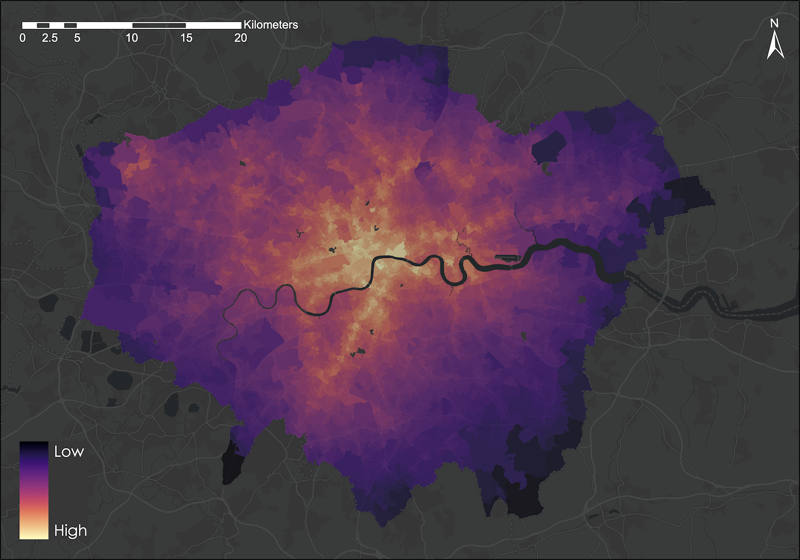
*Figure 3.1: Spatial separation accessibility result*

Figure 3.1 shows the result of accessibility for each LSOA in London, calculated with the spatial separation method.

A analysis of global autocorrelation using Moran’s I statistic returned a I value of 0.915541 , which yielded a z-score of 283.249050 with p<0.001. The positive z-score indicates a positive spatial autocorrelation at the p=0.001 level. Further analysis using Getis-Ord General G returned a observed G value of 0.000215, yielding a z-score of 102.092016 with p<0.001. This indicates that it is mainly the higher values which are clustred.

Local autocorrelation results using Anselin Local Moran’s I and Getis-Ord Gi\* are shown in Figure 3.2 and 3.3.

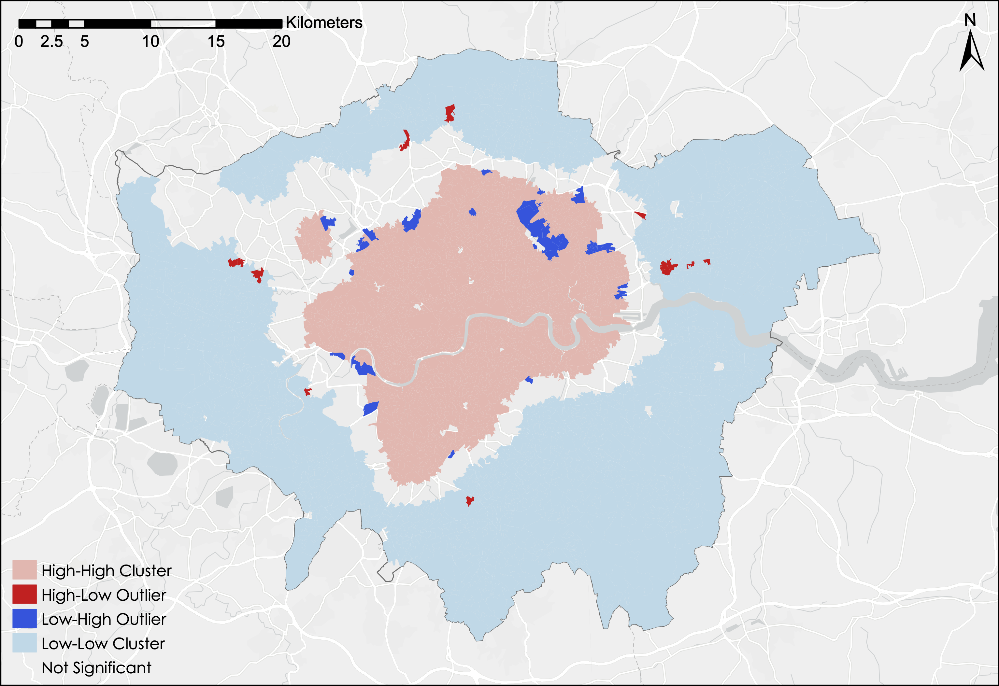
*Figure 3.2: Local spatial autocorrelation analysis using Anselin Local Moran’s I for spatial separation accessibility*

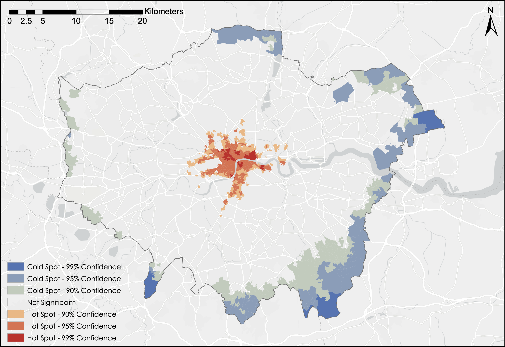
*Figure 3.3: Local spatial autocorrelation analysis using Getis-Ord Gi\* for spatial separation accessibility*

#### Gravity-based Characterization of Accessibility

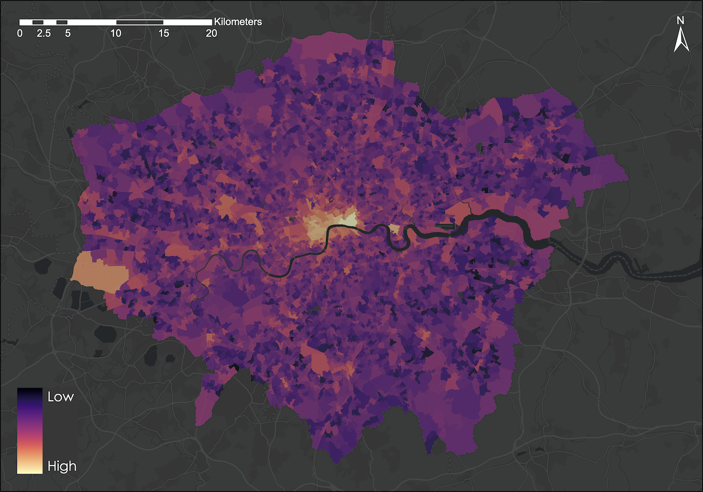
*Figure 3.4: Gravity-based accessibility result*

Figure 3.4 shows the result of accessibility for each LSOA in London, calculated with the gravity-based method.

A analysis of global autocorrelation using Moran’s I statistic returned a I value of 0.118189 , which yield- ed a z-score of 47.022867 with p<0.001. The positive z-score indicates a positive spatial autocorrelation at the p=0.001 level. Further analysis using Getis-Ord General G returned a observed G value of 0.001390, yielding a z-score of 46.026131 with p<0.001. This indicates that it is mainly the higher values which are clustred.

Local autocorrelation results using Anselin Local Moran’s I and Getis-Ord Gi\* are shown in Figure 3.5 and 3.6.

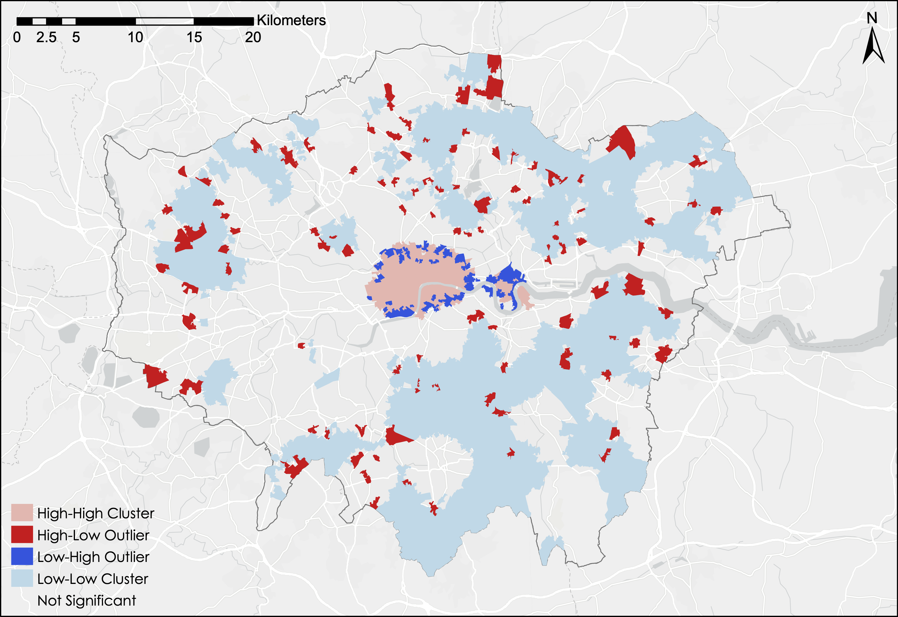
*Figure 3.5: Local spatial autocorrelation analysis using Anselin Local Moran’s I for gravity-based accessibility*

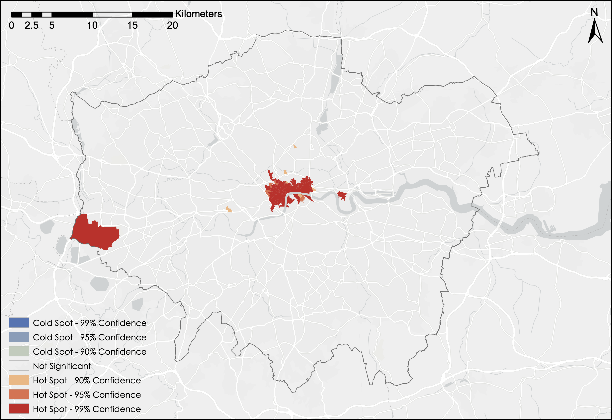
*Figure 3.6: Local spatial autocorrelation analysis using Getis-Ord Gi\* for gravity-based accessibility*

### Correlation Analysis - Accessibility and Deprivation
#### Overall Correlation

A correlation analysis was conducted to explore the relation- ship between deprivation and accessibility.

Figure 3.7 shows the overall correlation between IMD and gravi- ty-based accessibility values. It can be observed that the two variables displays a weak posiitve correlation.
The Pearson’s Product Moment Correlation Coefficient (PPMCC), r, is 0.056580 for the two variables, where p<0.001 (p=8.572506e-05). This indicates that a statistically significant positive correlation exists between accessibility and overall deprivation at p=0.001 level.

*Figure 3.7: Overall correlation beween the Index of Multiple Deprivation (IMD) and the gravity-based accessibility values for LSOAs in Greater London. Each blue point represent a LSOA and the black line represent the linear regression line using the Ordinary Least Squared (OLS) method.*

#### Correlation of accessibility with different types of deprivation

The correlation direction and strength strength is differ- ent for different aspects of deprivation.

Figure 3.8 graphs the correlation between gravity-based accessibiltiy and each type of deprivation. The r-values (for PPMCC) and the according p-values for the correlation between each type of deprivation and accessibility is calculated and summarized in Table 3.1. Asteroids indicates a statistically significant r (\* at p=0.10 level, \*\* p=0.05, \*\*\* p=0.01, \*\*\*\* p=0.001)

|     Type of   deprivation    |     Correlation   direction    |     Pearson’s Correlation   Coefficient (r)    |     p-value    |
|---|---|---|---|
|     Income    |     Negative    |     -0.000010    |     9.994623e-01    |
|     Employment    |     Negative    |     -0.023944*    |     9.669161e-02    |
|     Education    |     Negative    |     -0.136838****    |     1.475058e-21    |
|     Health    |     Positive    |     0.029316**    |     4.195778e-02    |
|     Crime    |     Positive    |     0.114724****    |     1.414367e-15    |
|     Barriers    |     Positive    |     0.016861    |     2.421408e-01    |
|     Environment    |     Positive    |     0.367655****    |     5.620738e-154    |

*Table 3.1: Direction, r-values, and p-values for the correla- tion between accessibility and different aspects of deprivation*

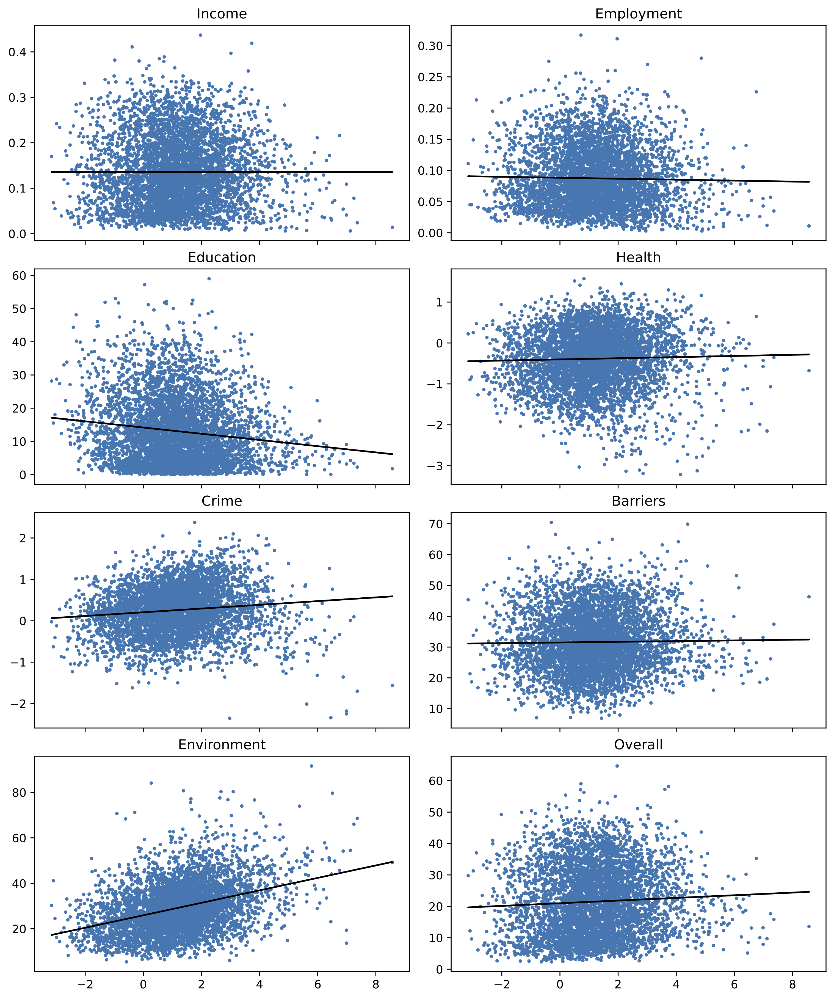
*Figure 3.8: Correlation between accessibility and different aspects of deprivation.*

It was shown that accessibility is positively correlated with Health deprivation & disabilty (r=0.029316), crime (r=0.114724), barriers to housing & sevrices (r=0.016861) and living environment deprivation (r=0.367655). It is negatively correlated with income deprivation (r=-0.000010), employment deprivation (r=-0.023944), and education, skills & training deprivation (r=-0.136838). The result is significant for employment (at p=0.10 level), eduation (at p=0.001), health (at p=0.05), crime (at p=0.001) and environment (at p=0.001).

#### Correlation at different population densities

It was also found that the direction and strength of correlation changes according to the population density.
The correlation between accessibility and deprivation changes from positive to negative as population density interval increases. In terms of PPMCC, r=0.335460 when population density interval is [0,1000) persons per square km. r decreases to -0.247983 when population density interval is [8000,9000).

|     Population   density interval (people per square km)    |     Correlation   direction    |     Pearson’s Correlation   Coefficient (r)    |     p-value    |
|---|---|---|---|
|     0-1000    |     Positive    |     0.335460****    |     2.186108e-10    |
|     1000-2000    |     Positive    |     0.234141****    |     6.923834e-11    |
|     2000-3000    |     Positive    |     0.123825****    |     1.034451e-04    |
|     3000-4000    |     Negative    |     -0.009638    |     7.886556e-01    |
|     4000-5000    |     Negative    |     -0.023909    |     5.575607e-01    |
|     5000-6000    |     Negative    |     -0.086580*    |     6.500895e-02    |
|     6000-7000    |     Negative    |     -0.170307***    |     1.966473e-03    |
|     7000-8000    |     Negative    |     -0.160363**    |     1.249210e-02    |
|     8000-9000    |     Negative    |     -0.247983***    |     2.067519e-03    |
|     9000-Max    |     Negative    |     -0.219683***    |     2.884823e-03    |

*Table 3.2: Direction, r-values, and p-values for the correla- tion at different population density ranges.*

This would imply that with higher urban characteristics, the spatial match of high accessibility and lower deprivation (more affluent). See Fig. 3.10 and 3.11 for the change of correlation direction with population density.

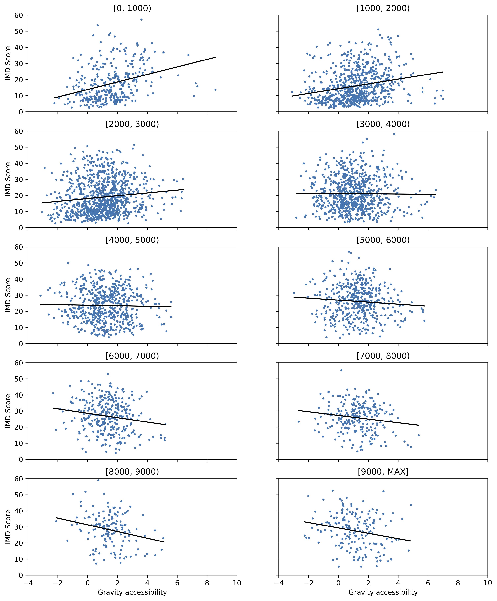
*Figure 3.10: Correlation at different population density ranges.*

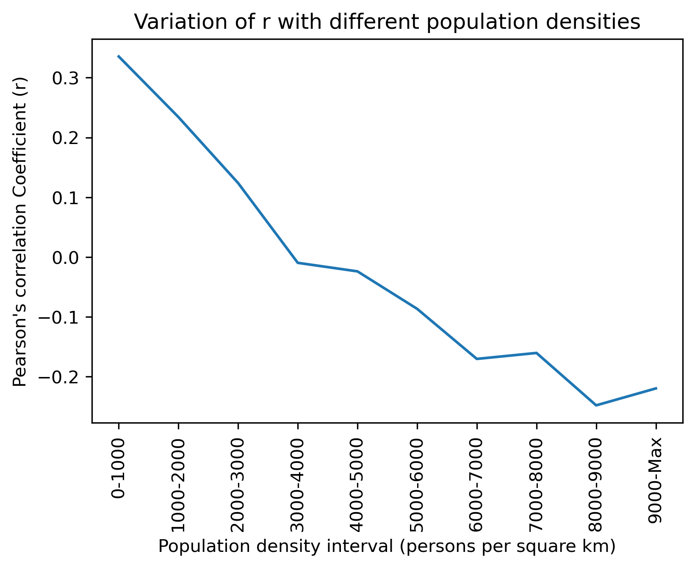
*Figure 3.11: r-values for the correlation*

*Figure 3.12: Three-dimensional scatter plot of values of deprivation (overall and for each aspect of deprivation), gravity-based accessibility and population density for LSOAs in Greater London.*
